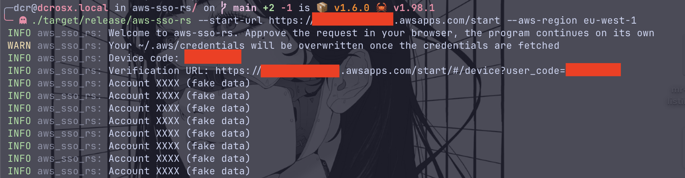
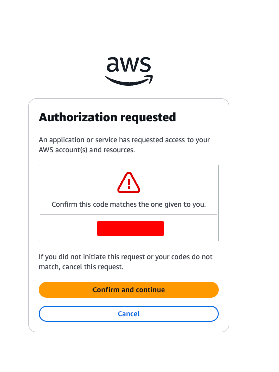
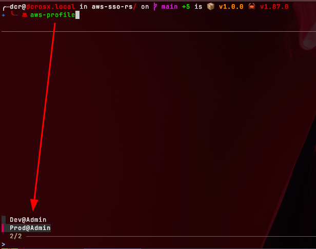

<p align="center">
  <h1 align="center">aws-sso-rs</h1>
  <p align="center">Fetch your local <code>~/.aws/credentials</code> for every AWS account you can access, using AWS SSO.</p>
  <p align="center">Built with ❤ in Rust</p>
</p>

<p align="center">
  <a href="https://github.com/containerscrew/aws-sso-rs/actions/workflows/ci.yml"></a>
  <a href="https://github.com/containerscrew/aws-sso-rs/releases/latest"></a>
  <a href="https://crates.io/crates/aws-sso-rs"></a>
  <a href="https://crates.io/crates/aws-sso-rs"></a>
  <a href="https://somsubhra.github.io/github-release-stats/?username=containerscrew&repository=aws-sso-rs"></a>
  <a href="./LICENSE"></a>
  
  <a href="https://github.com/pre-commit/pre-commit"></a>
  
</p>

> [!NOTE]
> AI coding assistants are used in this project only for architecture and design guidance,
> documentation, keeping the repository structure clean and maintaining the docstrings of the
> functions. They do not write application code unless explicitly instructed to. See
> [AGENTS.md](./AGENTS.md) for the rules agents follow here.

<p align="center">
  
</p>

## Table of contents

- [Why aws-sso-rs](#why-aws-sso-rs)
- [Requirements](#requirements)
- [Installation](#installation)
- [Usage](#usage)
- [Profile naming and overrides](#profile-naming-and-overrides)
- [Switching `AWS_PROFILE`](#switching-aws_profile)
- [Development](#development)
- [Roadmap](#roadmap)
- [License](#license)

## Why aws-sso-rs

If your organization has dozens of AWS accounts behind AWS IAM Identity Center (AWS SSO), getting CLI credentials for
each of them is tedious. `aws-sso-rs` runs the SSO device authorization flow once and then fetches the credentials for
**every account and role you have access to**, in parallel, writing them as ready-to-use profiles in
`~/.aws/credentials`.

- One browser approval, all accounts.
- Concurrent fetching with a configurable number of workers.
- Profile names are predictable (`AccountName@RoleName`) and can be overridden.
- Single static binary for Linux and macOS (amd64 and arm64).

## Requirements

- AWS IAM Identity Center configured with your IdP (Google Workspace, Okta, ...), and your start URL, for example
  `https://mycompany.awsapps.com/start`.
- A browser in which you are already authenticated with your IdP. It has only been tested with Google Workspace.
- [`fzf`](https://github.com/junegunn/fzf) (optional), only for the [profile switcher](#switching-aws_profile).

## Installation

### From crates.io

```shell
cargo install aws-sso-rs
```

### Pre-built binary

The installer detects your OS and architecture, verifies the SHA256 checksum of the download and installs the binary
in `/usr/local/bin`. It needs `curl` and `unzip`.

```shell
curl --proto '=https' --tlsv1.2 -sSfL https://raw.githubusercontent.com/containerscrew/aws-sso-rs/main/install.sh | sh
```

Install a specific version, or choose another directory:

```shell
curl --proto '=https' --tlsv1.2 -sSfL https://raw.githubusercontent.com/containerscrew/aws-sso-rs/main/install.sh | sh -s -- -v "v1.5.0"
curl --proto '=https' --tlsv1.2 -sSfL https://raw.githubusercontent.com/containerscrew/aws-sso-rs/main/install.sh | INSTALLATION_PATH="$HOME/.local/bin" sh
```

You can also download the zip for your platform from the [releases page](https://github.com/containerscrew/aws-sso-rs/releases).

### From source

```shell
git clone https://github.com/containerscrew/aws-sso-rs.git
cd aws-sso-rs
cargo build --release
./target/release/aws-sso-rs --help
```

> [!NOTE]
> Windows is not tested nor released. You can try compiling it yourself with `cargo build --release`.

## Usage

```shell
aws-sso-rs --start-url https://mycompany.awsapps.com/start --aws-region eu-west-1
```

1. Your default browser opens the AWS verification page. Check that the device code matches the one shown in the
   terminal and approve the request.
2. Go back to the terminal and press `Enter`.
3. The credentials of all your accounts are fetched and written to `~/.aws/credentials`.

<p align="center">
  
</p>

> [!WARNING]
> `aws-sso-rs` currently **overwrites `~/.aws/credentials`** with the profiles it fetches, so any other profile in that
> file (for example `default`) is lost. Back it up first. Merging instead of overwriting is the first item of the
> [roadmap](./roadmap.md).

> [!NOTE]
> The credentials are temporary (the duration is set by your SSO permission set, usually 1 hour). Run the tool again
> when they expire.

### Options

| Flag                  | Description                                                          | Default     |
| --------------------- | -------------------------------------------------------------------- | ----------- |
| `-s`, `--start-url`   | AWS SSO start URL. **Required**.                                     |             |
| `-r`, `--aws-region`  | Region where SSO is configured.                                      | `us-east-1` |
| `-w`, `--workers`     | Accounts processed in parallel (`1`-`20`).                           | `5`         |
| `--role-overrides`    | Rename role names in the profiles, `role=newname[,role2=newname2]`.  |             |
| `--account-overrides` | Rename account names in the profiles, `account=new[,account2=new2]`. |             |
| `-l`, `--log-level`   | `error`, `warn`, `info`, `debug` or `trace`.                         | `info`      |
| `--with-timestamp`    | Show a timestamp in each log line.                                   | off         |

Use fewer workers if you hit AWS API throttling (`429`) with a large number of accounts, and more to go faster.

```shell
aws-sso-rs -s https://mycompany.awsapps.com/start -r eu-west-1 -w 10
```

To debug the AWS SDK calls:

```shell
RUST_LOG=aws_config=trace,aws_smithy_runtime=debug aws-sso-rs --start-url https://mycompany.awsapps.com/start -r eu-west-1
```

> Rust AWS SDK logging documentation [here](https://docs.aws.amazon.com/sdk-for-rust/latest/dg/logging.html)

## Profile naming and overrides

Each account and role pair becomes a profile named `AccountName@RoleName` (spaces in the account name are removed):

```ini
[Development@AdministratorAccess]
aws_access_key_id = YOUR_ACCESS_KEY_ID
aws_secret_access_key = YOUR_SECRET
aws_session_token = YOUR_SESSION_TOKEN
region = YOUR_REGION
```

Rename the account part with `--account-overrides`:

```shell
aws-sso-rs -s https://mycompany.awsapps.com/start -r eu-west-1 --account-overrides Development=dev
```

```ini
[Development@AdministratorAccess]  ->  [dev@AdministratorAccess]
```

Use an empty value in `--role-overrides` to drop the role from the profile name:

```shell
aws-sso-rs -s https://mycompany.awsapps.com/start -r eu-west-1 --role-overrides AdministratorAccess="" --account-overrides Development=dev
```

```ini
[Development@AdministratorAccess]  ->  [dev]
```

> [!NOTE]
> A non-empty `--role-overrides` value currently replaces the whole profile name, so it only makes sense when a single
> account has that role. This is tracked in the [roadmap](./roadmap.md).

## Switching `AWS_PROFILE`

A small shell function lets you pick one of the generated profiles with [`fzf`](https://github.com/junegunn/fzf).

<details>
<summary>Bash / Zsh</summary>

Add this to your `~/.zshrc` or `~/.bashrc`:

```shell
function aws-profile() {
    local AWS_PROFILES
    AWS_PROFILES=$(sed -n -e 's/^\[\(.*\)\]/\1/p' ~/.aws/credentials | fzf)
    if [[ -n "$AWS_PROFILES" ]]; then
        export AWS_PROFILE=$AWS_PROFILES
        echo "Selected profile: $AWS_PROFILES"
    else
        echo "No profile selected"
    fi
}
```

</details>

<details>
<summary>Fish</summary>

Save this as `~/.config/fish/functions/aws-profile.fish`:

```shell
function aws-profile
    set -l selected (sed -n -e 's/^\[\(.*\)\]/\1/p' ~/.aws/credentials | fzf)
    if test -n "$selected"
        set -gx AWS_PROFILE $selected
        echo "Selected profile: $selected"
    else
        echo "No profile selected"
    end
end
```

</details>

Then run `aws-profile` in your terminal:

<p align="center">
  
</p>

## Development

```shell
git clone https://github.com/containerscrew/aws-sso-rs.git
cd aws-sso-rs
cargo build
cargo fmt --all -- --check
cargo clippy --all-targets --all-features -- -D warnings
cargo test
```

- Commits follow [Conventional Commits](https://www.conventionalcommits.org). Releases are cut with
  [cocogitto](https://docs.cocogitto.io) (`cog bump`), configured in [`cog.toml`](./cog.toml).
- Install the git hooks with `pre-commit install` ([pre-commit](https://pre-commit.com)) and `cog install-hook --all`.
- Everything in CI (security audit, lint, tests, release and crates.io publish) lives in
  [`.github/workflows/ci.yml`](./.github/workflows/ci.yml). Pushing a `v*.*.*` tag builds the binaries for Linux and
  macOS, creates the GitHub release and publishes the crate.

## Roadmap

See [roadmap.md](./roadmap.md).

## License

`aws-sso-rs` is distributed under the terms of the [GPL-3.0](./LICENSE) license.
