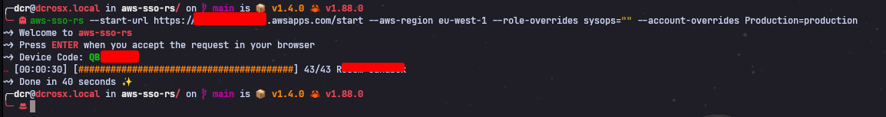

<p align="center" >
<h3 align="center">aws-sso-rs</h3>
<p align="center">Fetch your local ~/.aws/credentials using AWS SSO</p>
<p align="center">Built with ❤ in Rust</p>
</p>

---

[](/LICENSE)
[](https://github.com/pre-commit/pre-commit)

[](https://github.com/containerscrew/aws-sso-rs/actions/workflows/build.yml)
[](https://github.com/containerscrew/aws-sso-rs/actions/workflows/lint.yml)
[](https://github.com/containerscrew/aws-sso-rs/actions/workflows/release.yml)
[](https://github.com/containerscrew/aws-sso-rs/releases/latest)
[](https://somsubhra.github.io/github-release-stats/?username=containerscrew&repository=aws-sso-rs)

---
<p align="center">
    <h3 align="center">$ aws-sso-rs </h3>
    
</p>

---

# About

> [!NOTE]
> Is this necessary in Rust? I don't think so. In Python, it could be 50/60? lines of code. But it's definitely more fun.

This is the tool I use every day to obtain local credentials (`~/.aws/credentials`) for all the accounts I have access
in my company’s AWS organization. We have AWS SSO configured with Google Workspaces. So, through a browser authenticated
with my Google Gmail account, I authenticate via AWS SSO.

For example, we have 40 accounts in our AWS organization, and as a member of the cloud team, I have access to all of
them. So, when using this tool, I will be able to get the credentials for all those accounts with the corresponding
mapped role (in my case `AdministratorAccess`).

Therefore, you’ll need:

- AWS SSO configured with your external `IdP`, which could be `Okta`, `Google Workspaces`, etc., and obtain an endpoint
  like: https://mycompany.awsapps.com/start

- To be authenticated in your `default` browser with the `IdP` you use (in my case, I’ve only tested it with the one I
  use, which is `Gmail (Google)`).

# Installation

## From `creates.io`

```shell
cargo install aws-sso-rs
```

## Latest binary release

```shell
curl --proto '=https' --tlsv1.2 -sSfL https://raw.githubusercontent.com/containerscrew/aws-sso-rs/main/build/install.sh | sh
```

### Specific binary version

```shell
curl --proto '=https' --tlsv1.2 -sSfL https://raw.githubusercontent.com/containerscrew/aws-sso-rs/main/build/install.sh | sh -s -- -v "v1.1.0"
```

## Source code

```shell
git clone https://github.com/containerscrew/aws-sso-rs.git
cd aws-sso-rs
cargo build --release
./target/release/aws-sso-rs --flags... ## see next usage section
```

> Windows not tested and compiled. Try it by yourself compiling this source code using `cargo build --release`

# Usage

## Basic usage

```shell
aws-sso-rs --start-url https://mycompany.awsapps.com/start --aws-region eu-west-1
```

* `--start-url` is the URL of your AWS SSO endpoint, which you can find in your AWS SSO console.
* `--aws-region` is the AWS region where your SSO is configured, e.g., `eu-west-1`, `us-east-1`, etc.

> [!NOTE]
> This command will open your default browser. You will need to approve manually the authentication.

After you authenticate, you will come back to the terminal, and you will need to press `Enter` to continue.

Credentials will be stored in your `~/.aws/credentials` file, with the following format:

```ini
[AccountName@RoleName]
aws_access_key_id = YOUR_ACCESS_KEY_ID
aws_secret_access_key = YOUR_SECRET
aws_session_token = YOUR_SESSION_TOKEN
region = YOUR_REGION
```

## Overriding the `AccountName@RoleName`

You can override the `AccountName@RoleName` in your `~/.aws/credentials` by using the following flags:

```shell
aws-sso-rs --start-url https://mycompany.awsapps.com/start --aws-region eu-west-1 --role-overrides cloudteam="" --account-overrides Development=development-account
```

Which will result in the following credentials file:

```ini
[Development@cloudteam] --> [development-account]
```

I'm changing the account name from `Development` to `development-account`, and the role name from `cloudteam` to an
empty string (no role name in the credentials file).

If you want to override the role name only, you can do it like this:

```shell
aws-sso-rs --start-url https://mycompany.awsapps.com/start --aws-region eu-west-1 --role-overrides Developer-Team="developer-role"
```

```ini
[AccountName@Developer-Team] --> [AccountName@developer-role]
```

## Debug AWS SDK API calls

```shell
aws-sso-rs --start-url https://mycompany.awsapps.com/start --aws-region eu-west-1 --log-level debug
```

# Switching `AWS_PROFILE` in your terminal

## Zsh/Bash shell

Copy the following function in your `~/.zshrc` or `~/.bashrc`:

```shell
function aws-profile() {
    local AWS_PROFILES
    AWS_PROFILES=$(cat ~/.aws/credentials | sed -n -e 's/^\[\(.*\)\]/\1/p' | fzf)
    if [[ -n "$AWS_PROFILES" ]]; then
        export AWS_PROFILE=$AWS_PROFILES
        echo "Selected profile: $AWS_PROFILES"
    else
        echo "No profile selected"
    fi
}
```

Then, `source` the file if needed:

```shell
source ~/.zshrc or source ~/.bashrc
```

## Fish shell

Copy the following function inside `~/.config/fish/function/aws-profile.fish`

```shell
function aws-profile
    set -gx AWS_PROFILES $(cat ~/.aws/credentials | sed -n -e 's/^\[\(.*\)\]/\1/p' | fzf)
    if test -n "$AWS_PROFILES"
        set -xg AWS_PROFILE $AWS_PROFILES
        echo "Selected profile: $AWS_PROFILES"
    else
        echo "No profile selected"
    end
end
```

Then `source` the fish configuration:

```shell
source ~/.config/fish/config.fish
```

## Setting AWS_PROFILE

Type `aws-profile` in your terminal, and you will see all the accounts you have credentials in your
`$HOME/.aws/credentials`

<p align="center">
    <h3 align="center">$ aws-profile </h3>
    
</p>

> **fzf** is needed as a dependency for the interactive account switcher

# LICENSE

`aws-sso-rs` is distributed under the terms of the [`GPL3`](./LICENSE).
